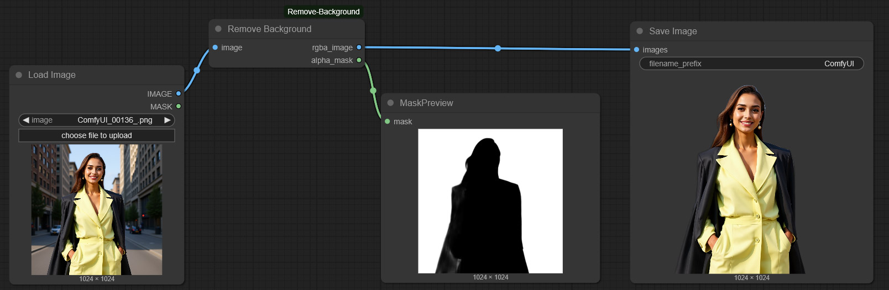
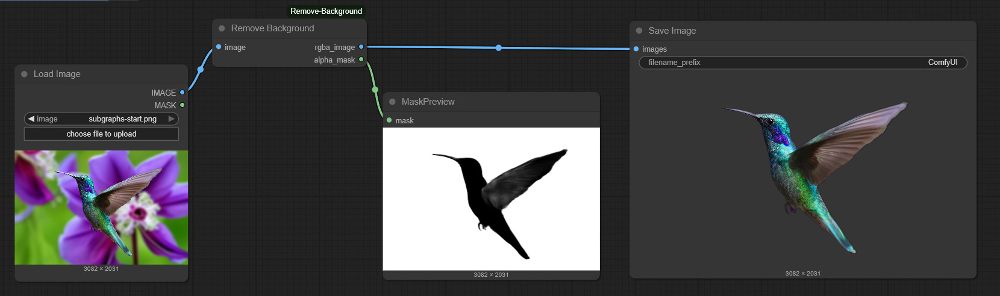

# ComfyUI Remove Background

Remove background scenery from an image of a person. The output image is saved as an RGBA PNG. The alpha channel is included.

## Installation

- Clone this repo into custom_nodes folder.
- Install dependencies: `pip install -r requirements.txt` or if you use the portable install, run this in `ComfyUI_windows_portable` folder:

  `python_embeded\python -m pip install -r ComfyUI/custom_nodes/comfyui-remove-background/requirements.txt`

## Install Remove Background Custom Node

Install the ComfyUI Remove Background custom node using the manager,


Or, install using your command/terminal prompt.

1. Navigate to your `ComfyUI/custom_nodes` folder.
2. Run,
   ```bash
   git clone https://github.com/Sean-Bradley/ComfyUI-Remove-Background.git
   ```
3. Navigate to your `ComfyUI_windows_portable` folder.
4. Run,
   ```bash
   python_embeded\python -m pip install -r ComfyUI/custom_nodes/comfyui-remove-background/requirements.txt
   ```
5. Restart ComfyUI

## Sample Workflows




